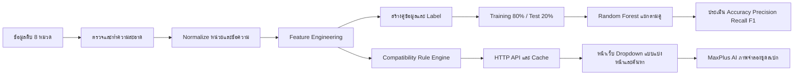

# กระบวนการพัฒนาระบบ AI และระบบตรวจความเข้ากันได้ของอุปกรณ์คอมพิวเตอร์

เอกสารนี้อธิบายกระบวนการของโครงการ BuildCores OpenDB ตั้งแต่ข้อมูลดิบ การเตรียมข้อมูล การสร้างชุดข้อมูลสำหรับ Machine Learning การฝึกและประเมินโมเดล จนถึงระบบแนะนำอุปกรณ์ที่ใช้งานผ่านหน้าเว็บ

> สรุปสำคัญ: ระบบปัจจุบันเป็น **Hybrid System** ประกอบด้วย 2 ส่วน
>
> 1. **Random Forest models** ใช้ทดลองเรียนรู้ความเข้ากันได้ของชิ้นส่วนแต่ละคู่จากข้อมูล
> 2. **Rule-based compatibility engine** ใช้กับหน้าเว็บจริง เพื่อให้การตัดอุปกรณ์ที่ใช้ไม่ได้อาศัย specification โดยตรง ไม่ปล่อยให้ AI เดาเรื่องสำคัญ เช่น socket ขนาด และกำลังไฟ

---

## อัปเดตล่าสุด: รูปสินค้า การค้นหา และภาพจำลองชุดสเปก

ฟีเจอร์ที่เพิ่มจากระบบ compatibility เดิมมีดังนี้:

1. เพิ่มคอลัมน์ `image_url` ชนิด `TEXT` ในตารางสินค้าทั้ง 8 หมวด เพื่อเก็บ URL รูปสินค้า
2. เพิ่ม `seed_selected_product_images.py` สำหรับบันทึกรูปอ้างอิงของชุดสเปกตัวอย่างลง PostgreSQL โดยผูกกับ `opendb_id` และชื่อสินค้าที่ตรงกัน
3. เพิ่มช่องพิมพ์ค้นหาใน dropdown ทั้ง 8 หมวด เรียก `/search?q=...` หลังหยุดพิมพ์ 250 ms และยังกรองเฉพาะสินค้าที่เข้ากันได้กับอุปกรณ์ซึ่งเลือกไว้แล้ว
4. เพิ่มปุ่มสร้างภาพจำลองหลังเลือกอุปกรณ์ครบ 8 หมวดและผ่านกฎ compatibility
5. เปลี่ยนระบบสร้างภาพไปใช้ MaxPlus Images API ที่ endpoint `https://api.maxplus-ai.cc/gpt-image/v1/images/generations` ด้วยโมเดลเริ่มต้น `gpt-image-2`
6. ส่งข้อมูลสินค้าครบ 8 ชิ้นภายใต้ข้อจำกัดสูงสุด 5 reference images ของ MaxPlus โดยส่ง Case, Motherboard, CPU Cooler และ GPU เป็นรูปเดี่ยว ส่วน CPU, RAM, PSU และ Storage รวมเป็น contact sheet 2×2 ในรูปที่ห้า
7. Prompt มี manifest ระบุประเภท ชื่อ และ `opendb_id` ครบทุกชิ้น พร้อมกำชับไม่ให้เพิ่ม ลด ทำซ้ำ เปลี่ยนรุ่น หรือเปลี่ยนสีอุปกรณ์เอง
8. เพิ่มการป้องกัน SSRF โดยรับเฉพาะ public HTTPS image URL ปฏิเสธ localhost/เครือข่ายภายใน ตรวจชนิดไฟล์ จำกัดไฟล์ 15 MB และย่อรูปไม่เกิน `1024×1024`
9. ป้องกันเว็บภายนอกเรียก `POST /assemble` ด้วยการตรวจ `Origin` เทียบกับ `Host` เพื่อลดความเสี่ยงจากการสร้างค่าใช้จ่ายโดยไม่ได้รับอนุญาต
10. จัดการกรณี browser ยกเลิก connection (`WinError 10053`) โดยไม่แสดง traceback ยาว และปรับข้อความ error จาก MaxPlus ให้แสดง HTTP status, error type และ request ID เมื่อมี
11. เพิ่ม `run_compatibility_web.bat` ให้ตรวจ dependency ถามรหัส PostgreSQL และ `MAXPLUS_API_KEY` แบบไม่แสดงตัวอักษร แล้วเปิด server กับ browser อัตโนมัติ
12. เพิ่มภาพหมุน 360° แบบ turntable โดยให้ MaxPlus สร้างภาพรอบเครื่องทุกมุมตามองศาที่เว้นระยะเท่ากัน และให้ผู้ใช้ลากเมาส์/นิ้ว ใช้ปุ่มลูกศร หรือเปิดหมุนอัตโนมัติบนหน้าเว็บ โดยไม่พึ่ง Image-to-3D API ภายนอก

ข้อควรทราบ: ภาพหมุนนี้เป็นชุดภาพ 2D จาก Generative AI ไม่ใช่โมเดล 3D จึงไม่รับประกันตำแหน่ง รูปร่าง รายละเอียดของ SKU หรือความต่อเนื่องระหว่างมุมได้ถูกต้อง 100% แม้ระบบจะส่งรูปและ manifest ครบทุกชิ้น

---

## 1. ที่มาและวัตถุประสงค์

ปัญหาที่ต้องการแก้คือ เมื่อผู้ใช้เลือก CPU หรืออุปกรณ์ชิ้นหนึ่งแล้ว ผู้ใช้ทั่วไปอาจไม่ทราบว่าอุปกรณ์ชิ้นอื่นใช้ร่วมกันได้หรือไม่ เช่น

- CPU ใช้ socket ตรงกับเมนบอร์ดหรือไม่
- CPU cooler รองรับ socket ของ CPU หรือไม่
- RAM เป็น DDR รุ่นเดียวกับที่เมนบอร์ดรองรับหรือไม่
- การ์ดจอยาวหรือหนาเกินพื้นที่เคสหรือไม่
- PSU มีกำลังไฟและหัวต่อเพียงพอหรือไม่
- เมนบอร์ด, PSU และอุปกรณ์อื่นมีขนาดที่ใส่ในเคสได้หรือไม่
- Storage ใช้ interface และ form factor ที่ระบบรองรับหรือไม่

เป้าหมายของระบบคือ:

1. ให้ผู้ใช้เริ่มจากการเลือก CPU
2. แสดงเฉพาะอุปกรณ์ที่ไม่พบหลักฐานว่าใช้ร่วมกันไม่ได้
3. ตรวจสอบซ้ำทุกครั้งที่เพิ่มหรือถอดอุปกรณ์
4. แสดงเหตุผลของผลตรวจ ไม่แสดงเฉพาะคำตอบว่าได้หรือไม่ได้
5. แยกกรณีข้อมูลไม่เพียงพอออกจากกรณีที่เข้ากันได้แน่นอน
6. ทำงานได้เร็วแม้ฐานข้อมูลมีสินค้าหลายพันรายการต่อหมวด

---

## 2. ภาพรวมสถาปัตยกรรม



เหตุผลที่แยกโมเดลออกจาก Rule Engine คือ ความเข้ากันได้ทางกายภาพและทางไฟฟ้าหลายข้อมีคำตอบตายตัว เช่น AM4 ไม่ใช่ FM2 หรือ GPU ยาว 340 mm ไม่สามารถใส่เคสที่รองรับได้เพียง 300 mm การใช้กฎจาก specification จึงตรวจสอบย้อนกลับและอธิบายเหตุผลได้ดีกว่าใช้ความน่าจะเป็นจากโมเดลเพียงอย่างเดียว

---

## 3. ข้อมูลที่ใช้

ข้อมูลมาจากชุดข้อมูล BuildCores OpenDB และผ่านกระบวนการจนอยู่ใน `data/processed/features` ฉบับเต็มสำหรับ ML ส่วนหน้าเว็บอ่านชุดย่อใน `data/processed/web_catalog` เพื่อไม่ให้การลดจำนวนสินค้ากระทบ training และ validation

จำนวนข้อมูล feature ปัจจุบัน:

| หมวด | จำนวนรายการ |
|---|---:|
| CPU | 789 |
| CPU Cooler | 2,398 |
| GPU | 3,835 |
| Motherboard | 3,699 |
| PC Case | 3,749 |
| PSU | 3,295 |
| RAM | 4,828 |
| Storage | 3,495 |

อุปกรณ์แต่ละรายการมี `opendb_id` เป็นรหัสอ้างอิงหลัก เพื่อป้องกันปัญหาสินค้าชื่อคล้ายกันหรือชื่อซ้ำกัน

---

## 4. ขั้นตอนตั้งแต่เริ่มต้น

### ขั้นตอนที่ 1: ตรวจโครงสร้างข้อมูลดิบ

ตรวจสอบไฟล์ CSV, ชื่อคอลัมน์, จำนวนแถว, ค่าว่าง, ชนิดข้อมูล และค่าที่ผิดรูปแบบก่อนนำไปใช้งาน

ตัวอย่างสคริปต์ที่เกี่ยวข้อง:

- `inspect_data.py`
- `data_quality.py`
- `data_validation.py`
- `normalized_quality.py`

สิ่งที่ต้องตรวจเป็นพิเศษคือค่า specification ที่นำไปใช้ตัดสินโดยตรง เช่น socket, RAM type, form factor, ความยาว, ความสูง, wattage และหัวต่อไฟ

### ขั้นตอนที่ 2: ทำความสะอาดข้อมูล

แปลงค่าที่ไม่มีความหมายให้เป็นค่าว่างมาตรฐาน เช่น:

- `None`
- `null`
- `NaN`
- `N/A`
- `-`
- ช่องว่างเปล่า

หลักการสำคัญคือ **ไม่แทนค่าที่ไม่รู้ด้วยเลข 0** เพราะเลข 0 อาจถูกตีความว่าเป็น specification จริงและทำให้ระบบตัดสินผิด

### ขั้นตอนที่ 3: Normalize ข้อมูล

ทำข้อความและหน่วยให้อยู่ในรูปแบบที่เปรียบเทียบกันได้ เช่น:

- ตัดช่องว่างส่วนเกิน
- ทำชื่อ socket ให้อยู่ในรูปแบบมาตรฐาน
- รวมรายการที่คั่นด้วย `|` เป็นชุดค่าที่เปรียบเทียบได้
- แปลงขนาดเป็น millimeter
- แปลงความจุเป็น GB
- แปลงกำลังไฟเป็น watt
- แยกจำนวน module ของ RAM
- แยกจำนวนสล็อต PCIe, M.2 และ SATA

ตัวอย่างปัญหาที่พบจริงคือชื่อสินค้า cooler ระบุว่าเป็น `AM4` แต่ข้อมูลต้นทางอาจมี socket กว้างเกินจริง ระบบจึงใช้ทั้ง field specification และ socket hint จากชื่อสินค้าเพื่อไม่ให้ cooler AM4 ถูกเสนอให้ CPU FM2

### ขั้นตอนที่ 4: Feature Engineering

ไฟล์ `feature_engineering.py` แปลงข้อมูลที่สะอาดแล้วเป็น feature ที่พร้อมใช้ทั้งกับโมเดลและ Rule Engine

ตัวอย่าง feature สำคัญ:

| หมวด | ตัวอย่าง Feature |
|---|---|
| CPU | socket, core, thread, base/boost clock, TDP, memory type |
| Motherboard | socket, chipset, RAM type, RAM slots, memory max, form factor, PCIe x16, M.2, SATA, power connectors |
| RAM | DDR type, capacity, module quantity, speed, CAS latency, ECC, registered, form factor |
| GPU | length, slot width, TDP, PCIe interface, power connectors |
| CPU Cooler | supported sockets, height, radiator size, fan size, water cooled |
| Case | supported motherboard/PSU form factors, GPU clearance, cooler clearance, PSU clearance, drive bays |
| PSU | wattage, form factor, length, ATX/EPS/PCIe/SATA connectors |
| Storage | type, interface, form factor, capacity |

นอกจากนี้ยังสร้าง feature อนุพันธ์ เช่น:

- `clock_gain = boost_clock - base_clock`
- `threads_per_core = threads / cores`
- `speed_score = RAM speed / CAS latency`
- จำนวน PCIe x16 slots
- จำนวน M.2 และ SATA ports
- จำนวนหัวต่อไฟแต่ละชนิด

### ขั้นตอนที่ 5: สร้างข้อมูลเป็นคู่

การตรวจ compatibility เป็นความสัมพันธ์ระหว่างอุปกรณ์อย่างน้อยสองชิ้น จึงไม่ฝึกโมเดลรวมทุกหมวดในครั้งเดียว แต่แยกเป็น dataset ตามคู่ดังนี้:

1. CPU ↔ Motherboard
2. CPU ↔ CPU Cooler
3. RAM ↔ Motherboard
4. GPU ↔ Case
5. CPU Cooler ↔ Case
6. Motherboard ↔ Case
7. PSU ↔ Case
8. Storage ↔ Motherboard

การแยกโมเดลเป็นคู่มีข้อดีคือ:

- แต่ละคู่ใช้ feature และกฎคนละชนิด
- อธิบายผลได้ง่ายกว่าโมเดลขนาดใหญ่ตัวเดียว
- แก้กฎหรือเพิ่มข้อมูลเฉพาะคู่ได้
- หาสาเหตุเมื่อโมเดลผิดได้ง่าย

### ขั้นตอนที่ 6: สร้าง Label

กำหนด target เป็น binary classification:

- `label = 1` หมายถึง Compatible
- `label = 0` หมายถึง Incompatible

Label ถูกสร้างจาก specification ที่ตรวจสอบได้ เช่น:

- socket CPU ตรงกับ socket เมนบอร์ด
- socket CPU อยู่ในรายการ socket ที่ cooler รองรับ
- RAM type ตรงกับชนิด RAM ของเมนบอร์ด
- GPU length ไม่เกิน GPU clearance ของเคส
- Cooler height ไม่เกิน cooler clearance ของเคส
- form factor เมนบอร์ดอยู่ในรายการที่เคสรองรับ
- form factor และความยาว PSU อยู่ในขอบเขตของเคส
- Storage interface/form factor มีพอร์ตหรือช่องติดตั้งรองรับ

คู่ที่ขาดข้อมูลจำเป็นจะไม่ถูกบังคับให้เป็น 0 หรือ 1 ใน training เพราะจะสร้าง label ผิด ส่วนระบบใช้งานจริงจะเก็บกรณีนี้เป็น `unknown`

### ขั้นตอนที่ 7: ทำ Dataset ให้สมดุล

ไฟล์ `build_training_dataset.py` สุ่มข้อมูลด้วย `RANDOM_SEED = 42` และจำกัดจำนวนสูงสุดที่ 10,000 รายการต่อ class

ชุดข้อมูลแต่ละคู่จึงมี:

- Compatible 10,000 คู่
- Incompatible 10,000 คู่
- รวม 20,000 คู่

การ balance class ช่วยไม่ให้โมเดลเลือกตอบ class ที่มีจำนวนมากกว่าเสมอ และทำให้ Accuracy ไม่หลอกตาจาก class imbalance

### ขั้นตอนที่ 8: ป้องกัน Data Leakage

Data leakage คือการนำข้อมูลที่ใช้สร้างคำตอบมาให้โมเดลเห็นโดยตรง ตัวอย่างเช่น สร้าง label จาก `socket_match` แล้วใส่ `socket_match` เป็น feature ด้วย โมเดลจะได้คะแนนเกือบ 100% โดยไม่เกิดการเรียนรู้ที่มีความหมาย

ก่อนฝึกโมเดลจึงตัดข้อมูลต่อไปนี้ออก:

- ID ของสินค้า
- target `label`
- ค่า match ที่ใช้สร้าง label เช่น `socket_match`, `ram_type_match`, `form_factor_match`
- direct specification ที่เป็นคำตอบโดยตรง เช่น socket ทั้งสองฝั่ง หรือ GPU length กับ case clearance

ผลคือคะแนนโมเดลอาจไม่สูงสมบูรณ์ แต่เป็นการประเมินที่ซื่อสัตย์กว่า โมเดลต้องเรียนรู้จาก feature ทางอ้อมแทนการอ่านเฉลย

### ขั้นตอนที่ 9: แบ่ง Training และ Testing

ใช้ `train_test_split` จาก scikit-learn:

- Training set 80%
- Testing set 20%
- `random_state = 42`
- `stratify = y`

เมื่อ dataset มี 20,000 คู่ จะได้:

- Training 16,000 คู่
- Testing 4,000 คู่

`stratify` ทำให้สัดส่วน Compatible/Incompatible ของทั้งสองชุดใกล้เคียงกัน

นอกจากนี้ยังสร้าง external validation แยกต่างหากจำนวน 4,000 คู่ต่อ dataset หรือ 2,000 คู่ต่อ class และตัดคู่ ID ที่ซ้ำกับ training ออก เพื่อทดสอบกับคู่สินค้าที่โมเดลไม่ได้เห็นในชุดฝึก

---

## 5. โมเดลที่ใช้

โมเดลหลักคือ **Random Forest Classifier** จาก scikit-learn

ค่าที่ตั้งไว้:

```python
RandomForestClassifier(
    n_estimators=200,
    random_state=42,
    class_weight="balanced",
    n_jobs=-1,
)
```

เหตุผลที่เลือก Random Forest:

- รองรับความสัมพันธ์ที่ไม่เป็นเส้นตรง
- ใช้ได้กับทั้ง numerical และ categorical features หลัง preprocessing
- ไม่ต้อง scale ตัวเลขเหมือนโมเดลบางประเภท
- ทนต่อ noise และ outlier ได้พอสมควร
- เหมาะเป็น baseline สำหรับข้อมูลตาราง
- ฝึกและเรียกใช้งานได้ด้วยทรัพยากรเครื่องทั่วไป

### Preprocessing ก่อนเข้าโมเดล

ใช้ scikit-learn `Pipeline` และ `ColumnTransformer` เพื่อให้ขั้นตอน preprocessing ติดไปกับไฟล์โมเดล:

1. Numerical columns
   - เติมค่าว่างด้วยค่ามัธยฐาน (`median`)
2. Categorical columns
   - เติมค่าว่างด้วยค่าที่พบบ่อยที่สุด (`most_frequent`)
   - แปลงเป็น One-Hot Encoding
   - `handle_unknown="ignore"` เพื่อรองรับ category ใหม่ตอนใช้งาน
3. ส่งผลลัพธ์เข้า Random Forest จำนวน 200 ต้นไม้

โมเดลและ preprocessing ถูกบันทึกรวมกันเป็น `models/<ชื่อคู่>/model.pkl`

---

## 6. ผลการฝึกโมเดล

ผลจาก `models/model_summary.csv`:

| คู่ข้อมูล | Accuracy | Precision | Recall | F1 |
|---|---:|---:|---:|---:|
| CPU–Motherboard | 95.88% | 94.39% | 97.55% | 95.94% |
| CPU–Cooler | 69.55% | 67.60% | 75.10% | 71.15% |
| RAM–Motherboard | 96.93% | 96.85% | 97.00% | 96.93% |
| GPU–Case | 77.98% | 80.62% | 73.65% | 76.98% |
| Cooler–Case | 78.23% | 75.93% | 82.65% | 79.15% |
| Motherboard–Case | 80.45% | 77.51% | 85.80% | 81.44% |
| PSU–Case | 81.30% | 78.95% | 85.35% | 82.03% |

ความหมายของ metric:

- **Accuracy**: สัดส่วนที่ทายถูกทั้งหมด
- **Precision**: เมื่อโมเดลบอกว่าเข้ากันได้ มีสัดส่วนที่ถูกจริงเท่าใด
- **Recall**: จากคู่ที่เข้ากันได้จริง โมเดลค้นพบได้เท่าใด
- **F1-score**: ค่าเฉลี่ยสมดุลระหว่าง Precision และ Recall

คะแนน CPU–Cooler ต่ำกว่าคู่อื่น เพราะเมื่อตัด socket และ `socket_match` ซึ่งเป็นเฉลยโดยตรงออก โมเดลเหลือข้อมูลทางอ้อมไม่มากพอ นี่เป็นหลักฐานว่าการใช้ Random Forest เพียงอย่างเดียวไม่เหมาะสำหรับตัดสิน socket ในระบบจริง

ผล external validation ที่บันทึกใน `models/validation_results.csv` และไม่ใช้ direct leakage columns:

| คู่ข้อมูล | Validation Accuracy | Validation F1 |
|---|---:|---:|
| CPU–Motherboard | 95.38% | 95.46% |
| RAM–Motherboard | 96.70% | 96.69% |
| GPU–Case | 76.75% | 75.98% |
| Cooler–Case | 76.90% | 77.87% |
| Motherboard–Case | 80.63% | 81.79% |

ผล validation ใกล้กับ test set แสดงว่าโมเดลไม่ได้ดีเฉพาะข้อมูลที่แบ่งจากไฟล์เดียวกัน อย่างไรก็ตาม ควรรัน pipeline ใหม่ทั้งหมดก่อนส่งรายงานฉบับสุดท้าย เพื่อให้ผลครบทุกคู่และมาจาก code version เดียวกัน

> หมายเหตุสถานะ repository ปัจจุบัน: มี dataset และไฟล์โมเดลของ Storage–Motherboard อยู่แล้ว แต่ `train_models.py` รุ่นปัจจุบันยังไม่ได้ใส่คู่นี้ไว้ใน `DATASETS` และไฟล์สรุปล่าสุดยังรายงานเพียง 7 คู่ จึงไม่ควรอ้างคะแนนของ Storage จนกว่าจะเพิ่ม config และรัน training/evaluation ใหม่

---

## 7. เหตุผลที่ระบบหน้าเว็บใช้ Rule Engine เป็นหลัก

เป้าหมายของหน้าเว็บคือไม่เสนออุปกรณ์ที่พิสูจน์ได้ว่าใช้ร่วมกันไม่ได้ ถ้าใช้ AI อย่างเดียว แม้ Accuracy 96% ก็ยังหมายความว่ามีโอกาสตอบผิดประมาณ 4% ซึ่งไม่เหมาะกับเงื่อนไขตายตัวทาง hardware

ดังนั้น `compatibility_engine.py` ใช้กฎจาก specification โดยตรง และใช้โมเดลเป็นงานทดลอง/ส่วนที่จะพัฒนาต่อ ไม่ได้ใช้ค่า prediction จาก `.pkl` เป็นผู้ตัดสินสุดท้ายใน API รุ่นปัจจุบัน

### กฎ CPU และ Motherboard

- เปรียบเทียบ socket แบบ normalized
- รองรับความสัมพันธ์แบบมีทิศทางสำหรับเมนบอร์ดบางตระกูล เช่น CPU FM2 อาจอยู่บนบอร์ด FM2+ ได้ แต่ไม่สรุปกลับทิศทางโดยอัตโนมัติ
- ถ้ามี GPU ต้องมี PCIe x16 slot
- ถ้า socket ไม่ตรง จะตัดเมนบอร์ดทันที

### กฎ CPU และ Cooler

- CPU socket ต้องอยู่ในรายการ socket ที่ cooler รองรับ
- ใช้ socket hint จากชื่อสินค้าเพื่อแก้ข้อมูลต้นทางที่กว้างผิดปกติ
- ตัวอย่าง: Cooler ที่ชื่อระบุ AM4 จะไม่ถูกเสนอให้ CPU FM2

### กฎ RAM และ Motherboard

- DDR type ต้องตรงกัน
- จำนวน RAM modules ต้องไม่เกินสล็อตบนเมนบอร์ด
- ความจุรวมต้องไม่เกินความจุสูงสุดของเมนบอร์ด
- ตรวจ ECC และ Registered memory เมื่อมีข้อมูล
- ข้อมูลที่ไม่พอจะเป็น `unknown` ไม่ใช่ compatible อัตโนมัติ

### กฎ GPU, Case และ Motherboard

- เมนบอร์ดต้องมี PCIe x16
- ความยาว GPU ต้องไม่เกิน clearance ของเคส
- ความหนาหรือจำนวนสล็อตของ GPU ต้องไม่เกิน expansion slots ที่มี
- PCIe generation ไม่ถูกตัดเพียงเพราะคนละรุ่น เนื่องจาก PCIe รองรับ backward compatibility โดยทั่วไป

### กฎ PSU

- ประมาณกำลังไฟขั้นต่ำจาก TDP ของ CPU และ GPU พร้อมเผื่อกำลังไฟระบบ
- wattage ของ PSU ต้องไม่น้อยกว่าค่าที่แนะนำ
- ตรวจหัวต่อ ATX 24-pin, EPS CPU, PCIe GPU และ SATA เมื่อมีข้อมูล
- ตรวจ form factor และความยาว PSU กับเคส

### กฎ Case

- รองรับ form factor ของเมนบอร์ด
- รองรับความยาวและความหนาของ GPU
- รองรับความสูงของ air cooler
- รองรับ form factor และความยาว PSU
- ตรวจช่องติดตั้ง Storage ตาม form factor เมื่อมีข้อมูล

### กฎ Storage

- ตรวจ SATA หรือ M.2 interface
- ตรวจ M.2/SATA port ของเมนบอร์ด
- ตรวจ form factor และ drive bay ของเคส
- ตรวจ SATA power connector ของ PSU เมื่อจำเป็น

---

## 8. สถานะผลตรวจสามระดับ

ระบบไม่ใช้เพียง true/false แต่แสดงสามสถานะ:

| สถานะ | สี | ความหมาย |
|---|---|---|
| `compatible` | เขียว | ข้อมูลที่จำเป็นครบและผ่านกฎที่ตรวจทั้งหมด |
| `unknown` | เหลือง | ยังไม่พบว่าใช้ไม่ได้ แต่ข้อมูลบาง field ไม่พอสำหรับยืนยัน |
| `incompatible` | แดง | มีอย่างน้อยหนึ่งกฎยืนยันว่าใช้ร่วมกันไม่ได้ |

คะแนน 0–100 บนหน้าเว็บวัด **ความครบถ้วนของการเลือกและความแน่นอนของ compatibility** ไม่ใช่คะแนน benchmark, ความแรง, ความคุ้มค่า หรือ CPU/GPU bottleneck

หลักการกรองคือ:

- ตัดรายการที่เป็น `incompatible`
- เก็บรายการ `compatible`
- กรณี `unknown` ไม่แอบเปลี่ยนเป็น compatible แต่รายงานข้อจำกัดให้ผู้ใช้ทราบ

---

## 9. API และหน้าเว็บ

`compatibility_api.py` เปิด HTTP endpoints:

```text
GET /health
GET /search
GET /recommend
POST /assemble
```

ลำดับการทำงานของหน้าเว็บ:

1. โหลดหน้าเว็บโดยยังไม่ดาวน์โหลดสินค้าทั้งหมด
2. ผู้ใช้เปิด CPU dropdown
3. หน้าเว็บขอข้อมูล CPU ครั้งละ 100 รายการ
4. เมื่อเลือก CPU จะเรียก `/recommend`
5. API คำนวณจำนวนอุปกรณ์ที่เข้ากันได้แต่ละหมวด
6. เมื่อเปิด dropdown หมวดอื่น หน้าเว็บเรียก `/search` พร้อม ID ของอุปกรณ์ที่เลือกแล้ว
7. API กรองด้วย Rule Engine ก่อนส่งรายการกลับ
8. เมื่อเลื่อนใกล้ท้าย dropdown จะขอหน้าถัดไปด้วย `offset`
9. เมื่อเลือกชิ้นส่วนเพิ่ม ระบบจะล้างเฉพาะตัวเลือกที่พึ่งพาและอาจไม่เข้ากัน แล้วคำนวณใหม่
10. ผู้ใช้สามารถพิมพ์ชื่อหรือบางส่วนของชื่อสินค้าในแต่ละ dropdown ระบบจะหน่วง 250 ms ก่อนค้นหาเพื่อลดจำนวน request

### ภาพจำลองชุดสเปกจาก AI

เมื่อเลือกอุปกรณ์ครบทั้ง 8 หมวดและชุดไม่อยู่ในสถานะ `incompatible` หน้าเว็บจะเปิดปุ่มสร้างภาพจำลอง ระบบทำงานดังนี้:

1. รับเฉพาะ `opendb_id` ของอุปกรณ์ที่ผู้ใช้เลือก
2. ตรวจซ้ำว่ามีครบ 8 หมวดและเป็นสินค้าใน catalog จริง
3. ดึง `image_url` ของสินค้าแต่ละชิ้นจาก PostgreSQL
4. ยกเลิกการสร้างภาพทันทีถ้าขาดรูปแม้แต่ชิ้นเดียว
5. ดาวน์โหลดและย่อรูปแต่ละรูปให้ไม่เกิน `1024×1024` โดยรักษาอัตราส่วนและไม่ขยายรูปเล็ก
6. เตรียม reference images ไม่เกิน 5 ไฟล์ตามข้อจำกัดของ MaxPlus: Case, Motherboard, CPU Cooler และ GPU เป็นรูปเดี่ยว ส่วน CPU, RAM, PSU และ Storage รวมเป็น contact sheet 2×2
7. คำนวณมุมรอบเครื่องที่เว้นระยะเท่ากัน ค่าเริ่มต้นคือ 8 มุมทุก 45 องศา
8. ส่งรูปแบบ base64 พร้อม manifest ของสินค้าครบ 8 ชิ้นและ prompt ระบุมุมกล้องไปยัง MaxPlus Images API แยกหนึ่ง request ต่อมุม โดยทำพร้อมกันสูงสุด 2 request
9. ขอผลลัพธ์แต่ละมุมแบบ `b64_json` แล้วตรวจความถูกต้องของ base64 ก่อนส่งชุดภาพกลับหน้าเว็บ
10. หน้าเว็บ preload ภาพและสลับเฟรมเมื่อผู้ใช้ลากเมาส์/นิ้ว กดปุ่มลูกศร หรือเปิดหมุนอัตโนมัติ
11. แสดงรายการอุปกรณ์ ขนาดรูปอ้างอิง และคำเตือนว่าเป็นชุดภาพจำลอง ไม่ใช่โมเดล 3D จริง

ภาพ generative AI ไม่สามารถรับประกันรายละเอียดทางกายภาพของ SKU ได้ 100% แม้ prompt จะห้ามเพิ่ม ลด หรือเปลี่ยนอุปกรณ์ ดังนั้นภาพนี้ใช้ช่วยให้ลูกค้าเห็นแนวทางหน้าตาของเครื่องเท่านั้น ต้องแสดงรูปสินค้าต้นฉบับและตรวจรายละเอียดจริงก่อนสั่งซื้อเสมอ

ค่าที่ต้องตั้งบนเครื่อง API:

```powershell
$env:MAXPLUS_API_KEY = "ccsk-<your-api-key>"
$env:MAXPLUS_IMAGE_MODEL = "gpt-image-2"
$env:MAXPLUS_TURNTABLE_VIEWS = "8" # เลือกได้ตั้งแต่ 4 ถึง 12
```

`MAXPLUS_API_KEY` ต้องเก็บฝั่ง server เท่านั้น ห้ามฝังไว้ใน HTML หรือ JavaScript และ `image_url` ต้องเป็น public HTTPS URL ระบบปฏิเสธ localhost/เครือข่ายภายใน ไฟล์ที่ไม่ใช่รูป และไฟล์เกิน 15 MB เพื่อลดความเสี่ยงจากการดาวน์โหลด URL ฝั่ง server

คีย์ต้องขึ้นต้นด้วย `ccsk-` และควรสร้างคีย์ใหม่ทันทีหากเคยเผยแพร่ในแชต, source code, screenshot หรือ log ห้าม commit คีย์จริงลง repository

`POST /assemble` ตรวจ `Origin` กับ `Host` และรับ request body ไม่เกิน 64 KB เพื่อป้องกันเว็บภายนอกเรียก endpoint โดยตรงและลดความเสี่ยงจาก request ที่ผิดปกติ การป้องกันนี้เหมาะกับ local server; หากนำขึ้น production ควรเพิ่ม authentication, rate limit, usage quota และ reverse proxy อีกชั้น

การใช้ `opendb_id` แทนการค้นจากชื่อช่วยให้ API เลือกสินค้าถูกตัวและลดปัญหาชื่อซ้ำ

---

## 10. การทำให้ระบบเร็วขึ้น

ปัญหาเดิมไม่ใช่เฉพาะเวลาคำนวณ แต่เกิดจาก browser ต้องสร้าง `<option>` หลายพัน element พร้อมกัน

สิ่งที่ปรับปรุงแล้ว:

- โหลด CSV เข้า memory ครั้งเดียวตอนเริ่ม API
- สร้าง index ตาม `opendb_id` และ socket
- cache ผล compatible search สูงสุด 512 context
- cache recommendation สูงสุด 256 context
- ส่ง JSON แบบ compact เป็น `[id, name]`
- รองรับ gzip เพื่อลดข้อมูลที่ส่งผ่าน network
- ใช้ JSON separators แบบ compact
- Dropdown แบบ lazy loading ครั้งละ 100 รายการ
- ค้นหาชื่อสินค้าฝั่ง API ด้วย `q` และ debounce 250 ms ฝั่ง browser
- ใช้ `offset` และ `has_more` สำหรับ pagination
- โหลดเฉพาะ dropdown ที่ผู้ใช้เปิด
- ไม่โหลดใหม่ถ้า dependency ที่มีผลต่อการกรองยังไม่เปลี่ยน
- PostgreSQL importer เตรียม index สำหรับ socket, memory type, wattage, form factor และ clearance

ผลทดสอบ local หลังแบ่งหน้า:

- CPU มี 789 รายการ แต่ครั้งแรกส่งเพียง 100 รายการ
- GPU มี 3,835 รายการ แต่ครั้งแรกส่งเพียง 100 รายการ
- GPU หน้าแรกประมาณ 4 ms
- GPU หน้าถัดไปประมาณ 1 ms เมื่อ cache พร้อม

การปรับความเร็วนี้ไม่ลดกฎการกรอง เพราะ API ยังกรองข้อมูลทั้งหมดด้วย context เดิมก่อนแบ่งผลลัพธ์เป็นหน้า

---

## 11. PostgreSQL และโครงสร้างฐานข้อมูล

`import_csv_to_postgres.py` แยกข้อมูลเป็น:

- `categories`
- `brands`
- `products`
- ตาราง specification ของอุปกรณ์ทั้ง 8 หมวด
- `product_catalog` view สำหรับดูข้อมูลรวม
- `image_url` ชนิด `TEXT` ในตารางสินค้าทั้ง 8 หมวด

ข้อมูลต้นฉบับทุก field ยังถูกเก็บใน `raw_data` ชนิด JSONB เพื่อป้องกันการสูญเสียข้อมูล แม้บาง field จะยังไม่ได้แยกเป็นคอลัมน์

การแยกตารางช่วยลดข้อมูลซ้ำ ทำ query ตามหมวดได้ง่าย และเพิ่ม index เฉพาะ field ที่ใช้ค้นหา/กรองบ่อยได้

---

## 12. วิธีสร้างระบบใหม่ตั้งแต่ต้น

รันจากโฟลเดอร์รากของ repository:

```powershell
python my-scripts/data_quality.py
python my-scripts/data_normalization.py
python my-scripts/normalized_quality.py
python my-scripts/feature_engineering.py
python my-scripts/build_training_dataset.py
python my-scripts/build_validation_dataset.py
python my-scripts/check_training_validation.py
python my-scripts/check_data_leakage.py
python my-scripts/train_models.py
python my-scripts/evaluate_models.py
python my-scripts/test_compatibility_engine.py
```

จากนั้นเปิด API:

```powershell
python -m pip install -r my-scripts/requirements-postgres.txt
python my-scripts/compatibility_api.py --port 8000
```

บน Windows สามารถดับเบิลคลิก `run_compatibility_web.bat` ที่โฟลเดอร์รากของโปรเจกต์ ระบบจะตรวจ dependency เปิด server และเปิด browser ให้อัตโนมัติ

เปิด browser ที่:

```text
http://127.0.0.1:8000/
```

> ชื่อและลำดับสคริปต์ช่วง cleaning/normalization ควรตรวจอีกครั้งก่อนรันแบบ production เพราะ repository มีสคริปต์ตรวจข้อมูลหลายรุ่น การรันต้องสำรองข้อมูลและดู output ของแต่ละขั้นก่อนส่งต่อไปขั้นถัดไป

---

## 13. ไฟล์หลักและหน้าที่

| ไฟล์ | หน้าที่ |
|---|---|
| `feature_engineering.py` | สร้าง feature ของสินค้า 8 หมวด |
| `build_training_dataset.py` | สร้างคู่ Compatible/Incompatible และ balance class |
| `build_validation_dataset.py` | สร้าง external validation และลดคู่ที่ซ้ำกับ training |
| `check_data_leakage.py` | ตรวจคอลัมน์ที่อาจเปิดเผย label |
| `check_training_validation.py` | ตรวจความสมดุลและการซ้ำของชุดข้อมูล |
| `train_models.py` | Preprocess, แบ่ง 80/20, ฝึก Random Forest และบันทึก `.pkl` |
| `evaluate_models.py` | ประเมินโมเดลกับ external validation |
| `compatibility_engine.py` | Rule Engine สำหรับกรองและอธิบายความเข้ากันได้ |
| `compatibility_api.py` | ให้บริการ HTTP API, index และ cache |
| `compatibility_ui.html` | หน้าเลือกอุปกรณ์ ช่องค้นหา แสดงสถานะสี และตัวดูภาพหมุน 360° |
| `build_visualizer.py` | ตรวจและย่อรูป สร้าง contact sheet เตรียม prompt รายมุม และเรียก MaxPlus Images API เพื่อสร้างชุดภาพ turntable |
| `seed_selected_product_images.py` | บันทึก URL รูปสินค้าตัวอย่างลง PostgreSQL |
| `run_compatibility_web.bat` | ตรวจ dependency รับรหัสแบบซ่อนค่า seed รูป เปิด API และ browser |
| `test_compatibility_engine.py` | Regression tests ของกฎ compatibility |
| `test_compatibility_api.py` | ทดสอบ HTTP API, cross-origin protection และ client disconnect |
| `test_build_visualizer.py` | ทดสอบรูปอ้างอิง prompt ข้อจำกัด 5 รูป payload ของ MaxPlus และลำดับมุม turntable |
| `import_csv_to_postgres.py` | สร้าง schema, tables, indexes และนำเข้าข้อมูล PostgreSQL |

---

## 14. ข้อจำกัดปัจจุบัน

ระบบยังไม่สามารถยืนยันข้อมูลต่อไปนี้ได้ครบ:

- BIOS version และ CPU support list รายเมนบอร์ด
- RAM QVL, XMP และ EXPO support list รายรุ่น
- ตำแหน่งและขนาดหม้อน้ำ AIO ที่ติดตั้งได้จริงทุกตำแหน่ง
- Cooling capacity ของ cooler เทียบกับ CPU package power จริง
- ระยะชนกันระหว่าง RAM, radiator, GPU และสายไฟ
- transient power spike ของ GPU
- ราคา ณ เวลาปัจจุบัน
- benchmark ประสิทธิภาพจริง
- bottleneck ตามเกม ความละเอียด และ workload

ดังนั้นคำว่า “เข้ากันได้” ในระบบหมายถึง **ผ่าน specification ที่ฐานข้อมูลมีและกฎที่ระบบตรวจได้** ไม่ได้หมายความว่ารับประกันทุกกรณีการติดตั้งจริง 100%

---

## 15. แนวทางพัฒนาต่อ

1. เพิ่มข้อมูล BIOS/QVL จากผู้ผลิต
2. เพิ่มข้อมูลราคาและ benchmark ที่มีเวลาอัปเดตชัดเจน
3. เพิ่ม model สำหรับจัดอันดับความเหมาะสม ไม่ใช่แทนกฎ compatibility
4. ใช้ probability จากโมเดลเฉพาะกรณีที่ข้อมูลกฎไม่ครบ และแสดง confidence
5. เพิ่ม Explainable AI เช่น feature importance หรือ SHAP
6. แยกข้อมูลตามช่วงเวลา เพื่อทดสอบกับสินค้ารุ่นใหม่จริง
7. ทำ Group Split ตาม product ID หรือ product family เพื่อลดความคล้ายกันระหว่าง train/test
8. เพิ่ม integration tests สำหรับ API และ browser
9. ทำให้ training config ครบ Storage–Motherboard และสร้างผลสรุปใหม่จาก pipeline รุ่นเดียวกัน

สถาปัตยกรรมที่เหมาะสมในอนาคตยังควรเป็น Hybrid:

- Rule Engine ทำหน้าที่ hard constraints
- AI ทำหน้าที่ ranking, suitability, value และ prediction ในส่วนที่ไม่มีคำตอบตายตัว

---

## 16. คำถามที่อาจารย์อาจถาม

### ระบบนี้ใช้ AI จริงหรือไม่

ใช้ Random Forest ฝึกแยกตามคู่ชิ้นส่วนจริงและมีไฟล์โมเดล/ผลประเมิน แต่ระบบหน้าเว็บรุ่นปัจจุบันใช้ Rule Engine เป็นตัวกรองหลัก เพราะ compatibility ทาง hardware เป็น hard constraint ที่ไม่ควรยอมให้โมเดลทายผิด

### แล้ว AI มีประโยชน์ตรงไหน

โมเดลแสดงให้เห็นว่าสามารถเรียนรู้ pattern ทางอ้อมจากข้อมูลตารางได้ และเหมาะนำไปพัฒนาต่อสำหรับการจัดอันดับความเหมาะสม ความคุ้มค่า หรือช่วยประเมินกรณีข้อมูลไม่ครบ ส่วนกฎยังคงเป็น safety layer

### ทำไมไม่ใช้ Neural Network

ข้อมูลเป็น structured/tabular data และจำนวนข้อมูลไม่ใหญ่มาก Random Forest จึงเป็น baseline ที่เหมาะกว่า ฝึกง่าย อธิบายได้ และไม่ต้องใช้ GPU สำหรับ training

### ทำไมคะแนนบางคู่ไม่สูง

เพราะตัด feature ที่เป็นเฉลยโดยตรงออกเพื่อป้องกัน data leakage โดยเฉพาะ socket และ clearance เมื่อเหลือเฉพาะข้อมูลทางอ้อม โมเดลจึงทำนายยากขึ้น แต่คะแนนที่ได้สะท้อนความสามารถจริงมากกว่า

### ทำไมหน้าเว็บไม่ใช้โมเดล `.pkl` โดยตรง

ถ้าโมเดล Accuracy 96% ยังมีโอกาสผิด 4% แต่ socket และขนาดอุปกรณ์ต้องถูกต้องตาม specification จึงให้ Rule Engine ตัดสิน hard constraints และเก็บโมเดลไว้สำหรับงานที่เป็น probabilistic/ranking

### สีเหลืองต่างจากสีเขียวอย่างไร

สีเขียวคือข้อมูลจำเป็นครบและผ่านกฎ สีเหลืองคือยังไม่พบความขัดแย้งแต่ข้อมูลบางส่วนไม่พอยืนยัน จึงไม่กล่าวอ้างว่าเข้ากันได้แน่นอน

### ทำอย่างไรไม่ให้ข้อมูล train กับ validation ซ้ำกัน

สร้าง external validation แยกต่างหากและใช้คู่ product ID ตรวจ overlap กับ training ก่อนบันทึก นอกจากนี้ใช้ seed เดิมเพื่อให้ทำซ้ำได้

---

## 17. ตัวอย่างสคริปต์พูดนำเสนอแบบสั้น

> โครงงานนี้เป็นระบบช่วยเลือกอุปกรณ์คอมพิวเตอร์ที่เข้ากันได้ โดยเริ่มจากข้อมูลสินค้า 8 หมวด เราทำความสะอาด Normalize หน่วย และทำ Feature Engineering จากนั้นสร้างข้อมูลเป็นคู่ เช่น CPU กับเมนบอร์ด หรือ GPU กับเคส แล้วสร้าง label Compatible และ Incompatible จาก specification ที่ตรวจสอบได้
>
> ในส่วน Machine Learning เราใช้ Random Forest จำนวน 200 trees แยกโมเดลตามคู่ชิ้นส่วน แบ่งข้อมูล Train 80% และ Test 20% ใช้ seed 42 และ balance class เท่ากัน ก่อนเข้าโมเดลมีการเติมค่าว่างและ One-Hot Encoding รวมถึงตัดคอลัมน์ที่เป็นเฉลยโดยตรงเพื่อป้องกัน data leakage
>
> แต่หน้าเว็บใช้งานจริงไม่ได้ให้ AI ตัดสินเพียงอย่างเดียว เพราะ socket ขนาด และกำลังไฟเป็นเงื่อนไขตายตัว เราจึงออกแบบเป็น Hybrid System โดย Rule Engine เป็นตัวกรองหลัก และ AI เป็นส่วนทดลองสำหรับเรียนรู้ pattern และพัฒนาการจัดอันดับในอนาคต
>
> ผลลัพธ์แสดงเป็นสีเขียว เหลือง และแดง โดยแยกข้อมูลไม่พอออกจากเข้ากันได้จริง ระบบมี API, cache, gzip และ dropdown แบบแบ่งโหลดครั้งละ 100 รายการ ทำให้รองรับข้อมูลหลายพันรายการได้โดยไม่ลดกฎการกรอง

---

## 18. สรุป

สิ่งที่โครงการนี้ทำไม่ใช่เพียงฝึกโมเดล แต่เป็น data pipeline และระบบใช้งานครบวงจร:

1. ตรวจและทำความสะอาดข้อมูล
2. Normalize specification
3. สร้าง feature
4. สร้าง label และ dataset เป็นคู่
5. Balance class และป้องกัน leakage
6. ฝึก Random Forest และประเมินผล
7. สร้าง Rule Engine ที่อธิบายเหตุผลได้
8. เปิดใช้งานผ่าน API และหน้าเว็บ
9. เพิ่ม cache, index, gzip และ pagination เพื่อรองรับข้อมูลจำนวนมาก
10. เพิ่มการค้นหาสินค้าใน dropdown โดยยังรักษาการกรอง compatibility
11. เพิ่มรูปสินค้าและสร้างภาพจำลองชุดสเปกผ่าน MaxPlus Images API

จุดเด่นของงานคือการเลือกใช้ AI เฉพาะส่วนที่เหมาะกับ AI และใช้กฎทางวิศวกรรมกับเงื่อนไขที่มีคำตอบตายตัว ทำให้ระบบอธิบายได้ ตรวจสอบย้อนกลับได้ และลดความเสี่ยงในการแนะนำอุปกรณ์ผิดรุ่น
